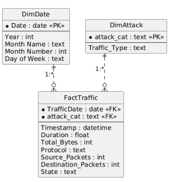

# Network Intrusion Traffic Analysis

DSA 3050A – Business Intelligence & Data Visualization | End Semester Practical Examination
Power BI solution built on the UNSW-NB15 network intrusion dataset.

## Section A: Dataset Selection & Understanding

### 1. Source of the Dataset

[UNSW-NB15 Network Intrusion Dataset on Kaggle](https://www.kaggle.com/datasets/mrwellsdavid/unsw-nb15), originally created by the Australian Centre for Cyber Security (ACCS) at UNSW Canberra.

### 2. What the Dataset Represents

The UNSW-NB15 dataset consists of raw network packets generated by the IXIA PerfectStorm tool in the ACCS Cyber Range Lab. It contains a hybrid of real modern normal network activity and synthetic contemporary attack behaviour. The dataset covers nine attack categories — Fuzzers, Analysis, Backdoors, DoS, Exploits, Generic, Reconnaissance, Shellcode and Worms — captured using the Argus and Bro-IDS network monitoring tools. Twelve algorithms were developed to generate 49 features plus a class label for each network flow.

The full dataset totals 2,540,044 records across four CSV files, with a dedicated training set (175,341 records) and testing set (82,332 records). A ground truth table (`UNSW-NB15_GT.csv`) and an event list (`UNSW-NB15_LIST_EVENTS.csv`) are also provided. It has been widely used in intrusion detection, network forensics, privacy-preserving analytics and threat intelligence research across network systems, IoT, SCADA, industrial IoT and Industry 4.0 environments. The dataset is freely available for academic research; commercial use requires the authors' approval.

### 3. Why I Selected It

This dataset provides a complex, real-world cybersecurity scenario with over 175,000 records in the training set alone, combining rich categorical variables (protocols, connection states, service types) with numerical variables (packet counts, byte counts, durations, TTLs). This mix is well suited to advanced threat analysis and supports multiple dimensions of BI investigation — volume, category, protocol, duration and network state — rather than a single flat summary.

### 4. Main Variables Available

| Variable | Description |
|---|---|
| `proto` | Transaction protocol (e.g. TCP, UDP) |
| `state` | Connection state and its dependent protocol |
| `dur` | Record total duration |
| `sbytes` / `dbytes` | Source-to-destination and destination-to-source byte counts |
| `sttl` / `dttl` | Source-to-destination and destination-to-source time-to-live |
| `service` | Network service (e.g. http, ftp, dns) |
| `attack_cat` | Name of each attack category |
| `label` | Binary identifier (0 = normal, 1 = attack) |

### 5. The Business/Analytical Problem

To design a Business Intelligence solution for a network security team that identifies vulnerabilities, monitors the frequency of specific attack vectors, and evaluates the impact of malicious traffic on network performance — supporting faster, evidence-based decisions on where to focus intrusion detection and prevention efforts.

### 6. Analytical Questions the Dashboard Will Answer

1. What is the overall ratio of normal network traffic compared to malicious attacks?
2. Which specific attack categories (e.g. Exploits, DoS, Fuzzers) are the most frequent?
3. Which network protocols are most heavily targeted by attackers?
4. How does the duration of an attack correlate with the type of threat?
5. What are the common network states associated with successful intrusions?

## Power Query Transformations

**Transformation 1: Removing the Redundant ID Column**

- **Problem:** The dataset included an `id` column which merely acted as a row index and offered no analytical value.
- **Transformation:** Used right-click → **Remove Column** on the `id` field.
- **Reason:** Removing unnecessary columns reduces the dataset's memory footprint and optimizes the data model for faster rendering.
- **Result:** The `id` column was successfully removed from the dataset.

**Transformation 2: Identifying Unknown Network Services**

- **Problem:** The `service` column contained a massive number of hyphens (`-`). In network engineering, this represents traffic where the specific application-layer protocol (e.g. HTTP, DNS, FTP) wasn't recognized by the packet sniffer.
- **Transformation:** Right-clicked the `service` column header, selected **Replace Values**, entered `-` as the Value To Find and `Unknown` as the Replace With value.
- **Reason:** When tracking offensive security metrics or monitoring threat landscapes, unclassified traffic often hides the most interesting anomalies (such as custom reverse shells or non-standard port usage), so it needed to be labelled explicitly instead of left as a vague hyphen.
- **Result:** The `service` column now contains an explicit `Unknown` category instead of an ambiguous hyphen, making unclassified traffic easy to filter and analyze on its own.

**Transformation 3: Creating a Custom Column (Total Bytes)**

- **Problem:** The dataset separated connection volume into source bytes (`sbytes`) and destination bytes (`dbytes`). Evaluating the overall severity or footprint of a network session requires assessing the total data volume exchanged.
- **Transformation:** Used **Add Column → Custom Column** to create a `Total_Bytes` field (`[sbytes] + [dbytes]`), and subsequently updated the data type to Whole Number.
- **Reason:** Creating a unified metric for total payload size simplifies the creation of volume-based KPIs and DAX measures, while correcting the data type ensures Power BI can perform mathematical aggregations on it.
- **Result:** A new `Total_Bytes` numerical column is available for overarching volume analysis.

**Transformation 4: Creating a Conditional Column (Traffic Type)**

- **Problem:** The dataset uses a binary integer flag (`label` = 0 or 1) to distinguish between normal and malicious traffic. Binary integers are not intuitive for end-users viewing dashboard legends.
- **Transformation:** Used **Add Column → Conditional Column** to create a `Traffic_Type` text field mapping 1 to `"Attack"` and 0 to `"Normal"`, then set the column's data type to Text.
- **Reason:** Converting technical binary flags into descriptive text categories ensures that chart legends and slicers are immediately readable by non-technical stakeholders.
- **Result:** A new categorical text column clearly distinguishing "Attack" vs "Normal" traffic streams.

**Transformation 5: Renaming Fields Appropriately**

- **Problem:** The dataset utilized technical abbreviations for column headers (e.g. `dur`, `proto`, `spkts`, `dpkts`), which would result in unintuitive labels on dashboard visuals.
- **Transformation:** Renamed these specific columns to `Duration`, `Protocol`, `Source_Packets`, and `Destination_Packets`.
- **Reason:** Renaming fields appropriately ensures that the final dashboard is user-friendly and that business users can easily understand the metrics without needing a data dictionary.
- **Result:** Column headers are now descriptive, plain-English terms.

**Transformation 6: Generating a Sequential Timestamp**

- **Problem:** The dataset lacked explicit date/time information (only recording transaction durations), which is fundamentally required for time-intelligence analysis and DimDate modeling.
- **Transformation:** Generated a synthetic sequential `Timestamp` by creating an Index column and applying a custom M-code formula (`#datetime(2026, 1, 1, 0, 0, 0) + #duration(0, 0, [Index], 0)`) to increment the time by one minute per transaction log, then typed the result as Date/Time and removed the now-unneeded Index column.
- **Reason:** This advanced transformation ensures the dataset supports time-series analysis and fulfills the requirement for constructing a relational Date Table for DAX time-intelligence metrics.
- **Result:** A fully functional `Timestamp` column was successfully integrated and typed as Date/Time.

**Transformation 7: Cleaning Text (Uppercase Service Names)**

- **Problem:** The `service` column contained lowercase acronyms (e.g. "dns", "http"), which look informal and unprofessional on a dashboard interface.
- **Transformation:** Used **Transform → Format → UPPERCASE** to standardize the text.
- **Reason:** Text cleaning and standardization ensure that slicers and chart labels are legible and adhere to professional presentation standards.
- **Result:** All recognized application-layer services are capitalized correctly (e.g. "DNS", "HTTP").

**Transformation 8: Creating a Dimension Table (Reference Query)**

- **Problem:** The dataset was imported as a single flat table, which violates the requirement for a dimensional Star Schema data model.
- **Transformation:** Created a Reference query named `DimAttack`, retained only the `attack_cat` and `Traffic_Type` columns, and applied **Remove Duplicates**.
- **Reason:** To extract descriptive attributes into a standalone dimension table, establishing the foundation for a one-to-many relationship with the primary fact table.
- **Result:** A unique `DimAttack` dimension table is ready for the data model.

## Data Modelling

The analytical model utilizes a Star Schema architecture designed to optimize query performance for security metric evaluation.

- **FactTraffic:** Forms the center of the model. It contains the transactional network logs, packet metrics, and connection durations. This was selected as the fact table because it holds the continuous, measurable events.
- **DimAttack:** A dedicated dimension table created to filter the fact table by specific offensive security categories (e.g. Exploits, DoS, Fuzzers) and generalized traffic types (Attack vs. Normal).
- **DimDate:** A dedicated calendar table constructed via DAX to enable precise time-intelligence calculations (e.g. assessing threat velocity over time).
- **Relationships:** Standard One-to-Many (1:*) relationships were established between each dimension table and FactTraffic.
- **Cardinality & Filtering:** Cross-filter direction is set to Single (from Dimensions to Fact) to avoid ambiguous filter paths and ensure predictable DAX aggregations.



## DAX & Business Calculations

The analytical engine of this model relies on 12 distinct DAX measures spanning core aggregations, derived business metrics, and advanced time-intelligence functions. Below is the documentation for the six most critical measures used in this solution.

**1. Total Malicious Events**
- **What it calculates:** The absolute count of network connection logs flagged specifically as attacks.
- **Why it is useful:** It isolates the primary threat metric, allowing security analysts to immediately see the sheer volume of attacks hitting the network.
- **Main DAX functions:** `CALCULATE()`, `COUNTROWS()` (via referenced measure).
- **Filter Context:** `CALCULATE` modifies the default filter context by explicitly enforcing `DimAttack[Traffic_Type] = "Attack"`, ignoring normal traffic regardless of visual level filters.
- **Dashboard Usage:** Used in the Executive Overview KPI cards and the trend line charts.

**2. Attack Rate %**
- **What it calculates:** The percentage of total network traffic that is classified as malicious.
- **Why it is useful:** Volume alone is misleading; this ratio provides true threat density, indicating if an influx of traffic is standard business operation or a coordinated DDoS/botnet attack.
- **Main DAX functions:** `VAR`, `RETURN`, `DIVIDE()`.
- **Filter Context:** Evaluates the row/filter context of the visual it is placed in (e.g. if placed in a table by Region, it calculates the attack rate specifically for that Region).
- **Dashboard Usage:** Displayed as a primary KPI card and used in gauge/donut charts.

**3. Previous Month Malicious Events**
- **What it calculates:** The count of attack events that occurred in the calendar month strictly prior to the current context.
- **Why it is useful:** It provides a historical baseline necessary for measuring short-term threat growth or the effectiveness of newly implemented firewall rules.
- **Main DAX functions:** `CALCULATE()`, `PREVIOUSMONTH()`.
- **Filter Context:** Uses the `DimDate` table to shift the current date filter context back by exactly one month, allowing side-by-side comparison with current-month metrics.
- **Dashboard Usage:** Primarily acts as a hidden calculation for the MoM Growth metric, but can be used in matrix visuals for side-by-side monthly comparisons.

**4. MoM Attack Growth %**
- **What it calculates:** The month-over-month percentage increase or decrease in cyberattack volume.
- **Why it is useful:** This is a critical executive-level metric that indicates whether the organization's security posture is improving (negative growth) or degrading (positive growth).
- **Main DAX functions:** `VAR`, `RETURN`, `DIVIDE()`.
- **Filter Context:** Inherits the filter context of the specific month being evaluated in the visual and compares it against the shifted historical context.
- **Dashboard Usage:** Highlighted in the Executive Overview as a variance KPI indicator (green for negative, red for positive).

**5. Total Payload Volume**
- **What it calculates:** The sum of all data (in bytes) transferred across the network.
- **Why it is useful:** Tracking data volume is essential for identifying data exfiltration (where hackers steal massive amounts of internal data).
- **Main DAX functions:** `SUM()`.
- **Filter Context:** Fully responsive to any slicers or visual cross-filtering applied on the report page (e.g. slicing by Date or Protocol).
- **Dashboard Usage:** Used in the Detailed Analysis page to track payload sizes across different attack categories.

**6. Average Payload per Event**
- **What it calculates:** The mean data size per individual network connection.
- **Why it is useful:** It helps identify anomalous behaviors. For example, a single connection transferring gigabytes of data is a major red flag compared to millions of tiny ping requests.
- **Main DAX functions:** `DIVIDE()`.
- **Filter Context:** Responsive to the dashboard's cross-filters, dynamically recalculating the average based on the active dimensionality (e.g. slicing by "FTP" protocol).
- **Dashboard Usage:** Utilized in scatter plots on the Diagnostic Analysis page to spot outliers.

## Professional Power BI Dashboards

The visualization layer is divided into three distinct pages, designed with a dark-themed Security Operations Center (SOC) aesthetic to reduce eye strain and highlight critical alerts.

**1. Executive Overview (SOC Threat Intelligence)**
- **Purpose:** To provide immediate, high-level visibility into the network's security posture.
- **Key Visuals:** Features core KPI cards (Total Events, Malicious Events, Attack Rate %, MoM Growth %), a trend line mapping attack velocity over time, and a clustered bar chart ranking attack categories.
- **Interactivity:** A Date slicer allows leadership to isolate specific timeframes, dynamically updating all KPIs.

**2. Detailed Analysis (Protocol & Payload Analytics)**
- **Purpose:** To drill down into the mechanics of the attacks, specifically how data is being moved across the network.
- **Key Visuals:** A donut chart showing payload distribution, a matrix visual enabling drill-down from attack category to specific protocols, and a filtered column chart isolating vulnerabilities.
- **Interactivity:** Slicers and cross-filtering allow analysts to click a specific protocol (e.g. HTTP) and instantly see its payload footprint and associated attack categories.

**3. Diagnostic Analysis (Threat Diagnostics & Outliers)**
- **Purpose:** To utilize advanced analytics and machine learning to identify the root causes and statistical drivers behind malicious traffic.
- **Key Visuals:**
  - A **Scatter Plot** maps average connection duration against payload size to identify outliers (e.g. "low-and-slow" attacks).
  - An **AI Key Influencers** visual statistically identifies which network states (e.g. INT) and protocols (e.g. UDP) are most likely to result in an attack.
  - A **Ribbon Chart** tracks how the rank and priority of different attack categories shift over the timeline.
- **Usability:** Tooltips and clean visual hierarchies ensure complex diagnostic data is easily readable for non-technical stakeholders.

## Repository Structure

```
DSA3050-PowerBI-669710/
│
├── README.md
├── data/
│   └── UNSW-NB15_c/
├── powerbi/
│   └── (.pbix file)
└── screenshots/
    ├── 01_raw_data.png
    ├── 02_power_query.png
    ├── 03_model.png
    ├── 04_dashboard_overview.png
    ├── 05_dashboard_analysis.png
    └── 06_dashboard_insights.png
```

## Project Sections

- [x] Section A: Dataset Selection & Understanding
- [x] Section B: Power Query – Data Cleaning & Transformation
- [x] Section C: Data Modelling
- [x] Section D: DAX & Business Calculations
- [x] Section E: Professional Power BI Dashboards
- [ ] Section F: GitHub, Screenshots & Documentation
